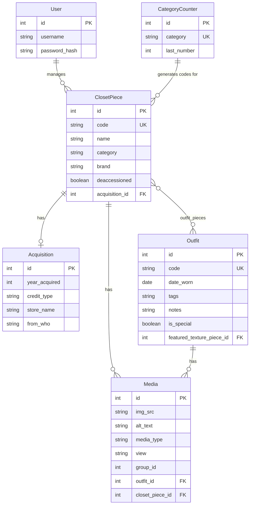

# Outfit Archive

A personal wardrobe catalog and outfit logging application built with Flask. Outfit Archive lets you document closet pieces with acquisition history, media, and deaccession tracking, then log outfits by combining pieces and attaching multi-view photos.

---

## Project Overview

Outfit Archive is a full-stack CRUD web application designed to function like a personal fashion archive. Each garment in the closet receives an auto-generated code (for example, `tops_1`, `bottoms_3`) based on its category. Pieces can include acquisition metadata (purchase, thrift, gift, or loan), standard and texture images, and deaccession status.

Authenticated users can add and edit closet pieces, browse the collection with client-side search and filtering, and log outfits by selecting pieces and submitting structured media payloads. Public visitors can browse closet pieces and outfit logs in read-only mode.

### Core Features

- **Closet piece management** — Create, view, and edit garments with category-based auto-coding
- **Acquisition tracking** — Record how and where each piece was acquired
- **Media support** — Attach standard piece images and optional texture images; outfit logs support multi-view media grouped by version
- **Deaccession workflow** — Mark pieces as deaccessioned with notes
- **Outfit logging** — Combine closet pieces into dated outfit records with tags, notes, and featured texture selection
- **Authentication** — Single-admin login via Flask-Login with CSRF protection
- **Public vs. admin views** — Separate templates for authenticated and public browsing

---

## Architecture

### Tech Stack

| Layer | Technology |
|-------|------------|
| Backend | Flask 3.x |
| ORM | SQLAlchemy 2.x via Flask-SQLAlchemy |
| Database | SQLite (stored in `instance/outfitarchive.db`) |
| Auth | Flask-Login, Werkzeug password hashing |
| Forms | Flask-WTF, WTForms |
| Migrations | Flask-Migrate (Alembic) |
| Frontend | Jinja2 templates, vanilla JavaScript, CSS |

### Application Layers

```
┌─────────────────────────────────────────────────────────┐
│  Browser (Jinja2 templates + static/main.js)          │
├─────────────────────────────────────────────────────────┤
│  Flask Routes (app.py)                                  │
│  ├── Page routes (HTML)                                 │
│  ├── JSON API (/api/closet-pieces)                      │
│  └── Auth (login, logout, setup)                        │
├─────────────────────────────────────────────────────────┤
│  Forms (forms.py)          │  Models (models.py)        │
│  WTForms validation        │  SQLAlchemy ORM            │
├─────────────────────────────────────────────────────────┤
│  Extensions (extensions.py)                             │
│  db · csrf · login_manager                              │
├─────────────────────────────────────────────────────────┤
│  SQLite Database (instance/outfitarchive.db)            │
└─────────────────────────────────────────────────────────┘
```

### Data Model

The schema centers on five main entities plus two supporting tables:



**Key design decisions:**

- **Auto-generated piece codes** — A SQLAlchemy `before_insert` event on `ClosetPiece` reads and increments `CategoryCounter` to produce codes like `{category}_{number}`.
- **Polymorphic media** — The `Media` model serves pieces, textures, and outfits via a `media_type` field (`piece`, `texture`, `outfit`, `outfit_alt`). Outfit media uses `group_id` to distinguish base vs. alternate outfit versions and `view` for front/back/left/right angles.
- **Many-to-many outfits** — `OutfitPieces` is an explicit association table linking outfits to closet pieces.
- **Outfit codes** — Generated on creation as `outfit_{YYYYMMDD}_{count}` based on the date worn.

### Request Flow (Adding a Closet Piece)

1. Authenticated user submits `AddClosetPieceForm` on the home page.
2. Flask-WTF validates form data and CSRF token.
3. An `Acquisition` record is created and committed.
4. A `ClosetPiece` is created; the `before_insert` listener assigns a category code.
5. A `Media` record (type `piece`) is attached to the new piece.
6. User is redirected with a flash message.

### Outfit Logging Flow

1. Admin loads `/test-log-outfit` and selects pieces via JavaScript checkboxes.
2. Client-side `outfit_payload` JSON (pieces, featured texture, media groups) is synced to a hidden form field.
3. On POST, Flask parses the payload, creates an `Outfit`, associates selected pieces, and attaches media records.

---

## Project Structure

```
outfitarchive/
├── app.py                  # Flask application, routes, and request handlers
├── models.py               # SQLAlchemy models and piece code generation logic
├── forms.py                # WTForms form definitions and media form builders
├── extensions.py           # Flask extension initialization (db, csrf, login_manager)
├── seed.py                 # Development seed data for closet pieces and outfits
├── requirements.txt        # Python dependencies
│
├── migrations/             # Alembic database migrations
│   ├── alembic.ini
│   ├── env.py
│   └── versions/
│       └── 72af44b5ea0a_initial_schema.py
│
├── scripts/
│   └── backfill_category_counters.py   # Backfill CategoryCounter from existing pieces
│
├── templates/              # Jinja2 HTML templates
│   ├── base.html           # Shared layout, nav, flash messages
│   ├── landing-public.html / landing-admin.html
│   ├── closet-pieces-public.html / closet-pieces-admin.html
│   ├── edit-piece.html
│   ├── login.html / setup.html
│   ├── outfit-log-test.html
│   ├── regular-outfit.html / show_outfits_test.html
│   └── unauthorized-public.html
│
├── static/
│   ├── styles.css          # Application styles
│   ├── main.js             # Closet filtering, outfit payload sync
│   └── media/              # Image assets (prototype uploads)
│
├── tests/
│   └── test_models.py      # Unit tests for models and helpers
│
└── instance/               # Flask instance folder (gitignored)
    └── outfitarchive.db    # SQLite database (created at runtime)
```

---

## Getting Started

### Prerequisites

- Python 3.11+
- pip

### Installation

```bash
# Clone the repository
git clone <repository-url>
cd outfitarchive

# Create and activate a virtual environment
python -m venv venv
source venv/bin/activate   # macOS/Linux
# venv\Scripts\activate    # Windows

# Install dependencies
pip install -r requirements.txt
pip install Flask-Migrate   # used for database migrations
```

### Database Setup

```bash
# Initialize migrations (first time only)
flask db init

# Apply migrations
flask db upgrade

# Optional: backfill category counters for existing data
python scripts/backfill_category_counters.py
```

### Running the Application

```bash
python app.py
```

The app runs at `http://127.0.0.1:5000` with debug mode enabled.

### First-Time Admin Setup

1. Visit `/setup` to create the admin account (username: `rero`).
2. Log in at `/login`.
3. Use the home page to add closet pieces.

---

## Testing

Tests live in `tests/test_models.py` and use Python's built-in `unittest` framework with an in-memory SQLite database.

### Running Tests

```bash
python -m unittest discover -s tests -v
```

Or run a specific test module:

```bash
python -m unittest tests.test_models -v
```

### Test Coverage

| Area | Tests | Status |
|------|-------|--------|
| User password hashing | `TestUserMethods` | Implemented |
| Closet piece image helpers (`piece_images`, `textures`) | `TestClosetPieceHelpers` | Implemented |
| Auto-generated piece codes | `TestClosetPieceModel` | Implemented |
| Acquisition relationships | `TestClosetPieceModel` | In progress |
| Outfit helpers | `TestOutfitHelper` | Planned (commented out) |

Each test class that touches the database extends `BaseTestCase`, which configures an in-memory SQLite URI, creates all tables in `setUp`, and drops them in `tearDown` to keep tests isolated.

### Planned Test Areas

- Media upload handling
- Search and filtering
- Edit workflows
- Acquisition and deaccession flows
- Form validations

---

## Routes Reference

| Route | Methods | Auth | Description |
|-------|---------|------|-------------|
| `/`, `/home` | GET, POST | Optional | Public landing or admin piece creation |
| `/setup` | GET, POST | Public | One-time admin account creation |
| `/login` | GET, POST | Public | Admin login |
| `/logout` | GET, POST | Optional | Log out |
| `/closet-pieces` | GET | Public | Browse all closet pieces |
| `/edit-closet-piece/<code>` | GET, POST | Required | Edit a piece by code |
| `/api/closet-pieces` | GET | Public | JSON API for closet pieces |
| `/test-log-outfit` | GET, POST | Required | Outfit logging (in development) |
| `/outfits` | GET | Public | View all logged outfits |
| `/test-outfit` | GET | Public | Single outfit detail view |

---

## Lessons Learned

This project strengthened my understanding of:

- **Relational database design** — Modeling wardrobe data with normalized tables, foreign keys, and association tables for many-to-many relationships
- **SQLAlchemy ORM relationships** — Configuring one-to-many, many-to-many, and back-populates; using SQLAlchemy events for auto-generated codes
- **Flask application architecture** — Separating concerns across `app.py`, `models.py`, `forms.py`, and `extensions.py`
- **File upload workflows** — Structuring media metadata and planning drag-and-drop upload pipelines
- **Form validation** — Using WTForms validators and surfacing field-level errors via flash messages
- **Database migrations** — Managing schema changes with Flask-Migrate and Alembic
- **CRUD application development** — Building create, read, update, and delete flows for closet pieces and outfits
- **Test-driven development practices** — Writing isolated unit tests with in-memory databases and a shared base test case

---

## Future Improvements

### Testing
- Media upload handling
- Search and filtering
- Edit workflows
- Acquisition and deaccession flows
- Form validations

### Features
- Front-end outfit creation and management
- Advanced filtering
- Seasonal wardrobe analytics
- Garment wear tracking
- Multi-user support
- REST API
- Mobile optimization
- Improved media management and batch uploading

---

## License

Personal project — all rights reserved.
